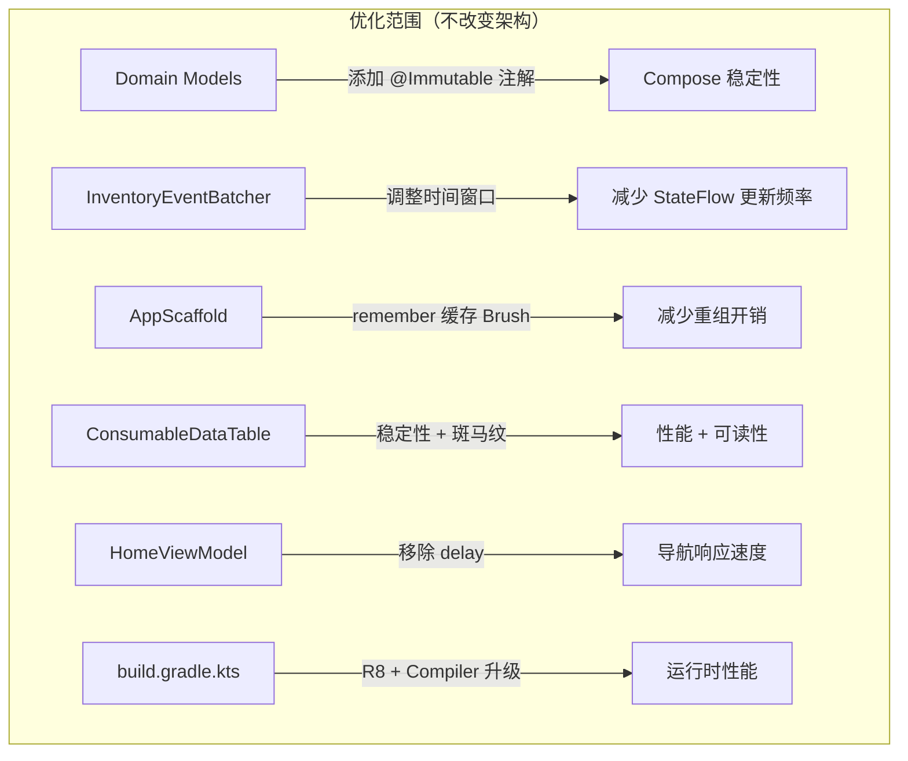

# 设计文档：性能优化与 UI 简洁化

## 概述

本设计针对耗材屋安卓设备端在 RK3568 嵌入式硬件上的性能瓶颈和 UI 可读性问题，提出一套低风险、渐进式的优化方案。核心原则：**性能优先、简洁清晰、零业务逻辑变更**。

优化分为两大方向：
1. **性能优化**：减少 Compose 不必要重组、优化高频事件处理、启用 R8 代码缩减、消除人为延迟
2. **UI 简洁化**：提升数据表可读性、统一间距与视觉层次、增强状态提示的信息密度

## 架构

现有架构保持不变（MVVM + Hilt DI + Compose UI），优化仅在以下层面进行：



变更不涉及：
- HTTP API 调用层（CabinetRepository、CabinetApi）
- MQTT 消息订阅与解析层（MqttManager）
- 业务状态机（InventoryFlowState 的转换逻辑）
- 导航路由结构

## 组件与接口

### 1. Domain Models 稳定性标注

**变更文件**：`DomainModels.kt`

为高频传入 Composable 的数据类添加 `@Immutable` 注解：

```kotlin
@Immutable
data class ConsumableUiModel(
    val id: Int,
    val rfid: String,
    val code: String,
    val name: String,
    val cabinetId: Int,
    val currentLocationName: String,
    val currentLocationId: String,
    val payload: ConsumableDto
)

@Immutable
data class UiMessage(
    val text: String = "",
    val level: MessageLevel = MessageLevel.Info,
    val nonce: Long = System.nanoTime()
)

@Immutable
data class ScanWarning(
    val type: ScanWarningType,
    val count: Int,
    val message: String
)
```

**设计决策**：选择 `@Immutable` 而非 `@Stable`，因为这些 data class 的所有字段都是 val 且类型本身不可变（基本类型、String、enum）。`ConsumableDto` 作为 `@Serializable` data class 也满足不可变条件，需同步标注。Compose Compiler 在检测到 `@Immutable` 后会跳过对该参数的 equals 检查，直接认定未变化，从而避免不必要的重组。

### 2. ConsumableDataTable 性能与可读性优化

**变更文件**：`ConsumableDataTable.kt`

性能优化：
- 将 `TableColumn` 标记为 `@Immutable`（纯数据，不可变）
- 提取硬编码 Color 值为顶层常量，避免重组时重复创建
- `CellContent` 中的 `onRemove` lambda 通过 `remember` 稳定化

可读性优化：
- 数据行添加交替背景色（斑马纹），使用极低透明度以不增加渲染负担
- 表头背景色加深，增加底部分隔线
- 冲突行保持现有红色高亮，增加左侧色条标识
- 适当增加行高和单元格内边距

```kotlin
// 顶层颜色常量
private val TableHeaderBg = Color(0x441B4E88)
private val RowEvenBg = Color(0x0DFFFFFF)
private val RowOddBg = Color.Transparent
private val ConflictRowBg = Color(0x33E16969)
private val DividerColor = Color(0x1AFFFFFF)

@Immutable
data class TableColumn(
    val header: String,
    val width: Dp
)
```

**设计决策**：斑马纹使用极低透明度的白色叠加（`0x0D` = 5% 不透明度），在暗色主题下提供足够的行间区分而不增加 GPU 绘制压力。不使用渐变或阴影效果。

### 3. AppScaffold Brush 缓存

**变更文件**：`AppScaffold.kt`

将 `backgroundBrush` 的创建包裹在 `remember(variant)` 中，避免每次重组重新创建 Brush 对象：

```kotlin
val backgroundBrush = remember(variant) {
    when (variant) {
        AppScaffoldVariant.Login -> Brush.linearGradient(
            listOf(Color(0xFF031026), Color(0xFF07172D))
        )
        // ...
    }
}
```

**设计决策**：`variant` 在单个页面生命周期内不会变化，因此以 `variant` 作为 remember key 是安全的。这避免了每帧都创建新的 Brush 对象。

### 4. HomeViewModel 导航延迟移除

**变更文件**：`HomeViewModel.kt`

移除 `launchNavigation` 中的 `delay(450)`，改用 `consumeRouteLock()` 回调机制（已存在于 HomeScreen 的 `LaunchedEffect` 中）来解锁路由：

```kotlin
private fun launchNavigation(key: String, navigate: () -> Unit) {
    if (_state.value.routeLocked) return
    _state.value = _state.value.copy(routeLocked = true)
    PerfMonitor.mark("home_card_${key}_navigate_start")
    navigate()
    // routeLocked 由目标页面的 consumeRouteLock() 解锁，无需人为延迟
}
```

**设计决策**：当前 `delay(450)` 的目的是防止快速重复点击导致多次导航。但 `routeLocked` 标志位 + 目标页面的 `consumeRouteLock()` 已经提供了这个保护。移除 delay 后，`launchNavigation` 不再需要是 suspend 函数，可以直接同步执行，减少协程开销。

### 5. InventoryEventBatcher 时间窗口调整

**变更文件**：`InventoryEventBatcher.kt`

将默认 `flushWindowMs` 从 140ms 调整为 300ms，更适合 RK3568 的处理能力：

```kotlin
class InventoryEventBatcher(
    private val scope: CoroutineScope,
    private val flushWindowMs: Long = 300L,  // 从 140ms 调整为 300ms
    private val maxBatchSize: Int = 32,
    private val onFlush: (List<String>) -> Unit
)
```

**设计决策**：140ms 在高性能设备上合理，但 RK3568 的 CPU/GPU 性能有限，频繁的 UI 刷新会导致帧丢失。300ms 窗口在"实时感"和"流畅度"之间取得平衡——用户仍能看到列表在持续更新，但不会因为过于频繁的重组导致卡顿。`maxBatchSize = 32` 保持不变，确保大批量事件仍能及时处理。参数保持构造函数可配置，便于针对不同硬件调优。

### 6. 构建配置优化

**变更文件**：`app/build.gradle.kts`、`app/proguard-rules.pro`

#### R8 启用

```kotlin
release {
    isMinifyEnabled = true
    isShrinkResources = true
    proguardFiles(
        getDefaultProguardFile("proguard-android-optimize.txt"),
        "proguard-rules.pro"
    )
}
```

#### ProGuard 规则

需要为以下依赖添加 keep 规则：
- **Kotlin Serialization**：保留 `@Serializable` 类和序列化器
- **Retrofit + OkHttp**：保留接口方法签名和注解
- **Hilt/Dagger**：保留注入相关类
- **Paho MQTT**：保留回调接口
- **Compose**：通常不需要额外规则（AGP 自动处理）

#### Compose Compiler 升级

将 `kotlinCompilerExtensionVersion` 从 `1.5.15` 升级至与 Kotlin 版本兼容的最新稳定版。需要检查当前 Kotlin 版本的兼容性矩阵。

**设计决策**：R8 在 Release 构建中可以显著减小 APK 体积并优化字节码，对嵌入式设备的启动速度和运行时性能都有帮助。ProGuard 规则需要仔细配置以避免运行时反射失败。

### 7. StatusBanner 图标增强

**变更文件**：`StatusBanner.kt`

为每个消息级别添加对应的 Material Icon：

```kotlin
val icon = when (message.level) {
    MessageLevel.Info -> Icons.Outlined.Info
    MessageLevel.Success -> Icons.Outlined.CheckCircle
    MessageLevel.Warning -> Icons.Outlined.Warning
    MessageLevel.Error -> Icons.Outlined.Error
}
```

在现有的 Row 布局中，色条后面添加图标，图标使用 `palette.accent` 颜色。

**设计决策**：使用 Outlined 风格图标，视觉重量轻，与暗色主题协调。不添加任何动画效果。

### 8. EmptyState 图标增强

**变更文件**：`EmptyState.kt`、`ConsumableDataTable.kt`

为 EmptyState 组件添加可选的图标参数：

```kotlin
@Composable
fun EmptyState(
    title: String,
    subtitle: String,
    icon: ImageVector? = null,
    modifier: Modifier = Modifier
)
```

ConsumableDataTable 的空状态使用 `Icons.Outlined.Inventory2` 或类似图标，配合现有文案。

### 9. 登录页面简洁化

**变更文件**：`LoginScreen.kt`

- 在登录卡片顶部添加应用名称/品牌标识（纯文字，使用 `displaySmall` 字体样式）
- 统一卡片内部间距
- 不添加任何动画或特效

### 10. 间距统一

**变更文件**：多个组件文件

定义统一的间距常量（可在 Theme 或专用常量文件中）：

```kotlin
object CabinetSpacing {
    val panelPadding = 16.dp
    val sectionGap = 12.dp
    val elementGap = 8.dp
    val cardRadius = 16.dp
    val chipRadius = 999.dp  // 全圆角
}
```

审查并统一各组件中的硬编码间距值。

## 数据模型

数据模型结构不变，仅添加 Compose 稳定性注解：

| 类名 | 变更 | 原因 |
|------|------|------|
| `ConsumableUiModel` | 添加 `@Immutable` | 高频传入 LazyColumn items，减少重组 |
| `UiMessage` | 添加 `@Immutable` | 传入 StatusBanner/Snackbar，减少重组 |
| `ScanWarning` | 添加 `@Immutable` | 传入 WarningDialog，减少重组 |
| `InventoryCoreState` | 添加 `@Immutable` | 作为 StateFlow 值传入多个 Composable |
| `TableColumn` | 添加 `@Immutable` | 传入 ConsumableDataTable 内部使用 |
| `ConsumableDto` | 添加 `@Immutable` | 作为 `ConsumableUiModel.payload` 的类型 |


## 正确性属性

*正确性属性是一种在系统所有有效执行中都应成立的特征或行为——本质上是关于系统应该做什么的形式化陈述。属性是人类可读规范与机器可验证正确性保证之间的桥梁。*

基于需求文档中的验收标准，以下属性可通过属性基测试（Property-Based Testing）进行验证：

### Property 1: 数据模型不可变性约束

*For any* `@Immutable` 标注的数据类（ConsumableUiModel、UiMessage、ScanWarning、InventoryCoreState），其所有字段均为 `val` 声明且字段类型为不可变类型（基本类型、String、enum、其他 @Immutable 类、不可变集合）。

**Validates: Requirements 1.1**

### Property 2: 路由锁防重复导航

*For any* HomeViewModel 实例，当 `routeLocked = true` 时，连续调用 `launchNavigation` 不会触发额外的 `navigate()` 回调。即：对于任意次数的连续导航调用，`navigate` 回调最多执行一次。

**Validates: Requirements 2.1**

### Property 3: 事件批处理合并

*For any* 一组在同一时间窗口内通过 `offer()` 提交的 RFID 事件码序列，InventoryEventBatcher 的 `onFlush` 回调应在窗口结束时被调用恰好一次，且回调参数包含该窗口内所有去重后的事件码。

**Validates: Requirements 4.2**

### Property 4: 交替行背景色

*For any* 非空的耗材列表，ConsumableDataTable 中第 i 行的背景色应由 `i % 2` 决定：偶数行使用 `RowEvenBg`，奇数行使用 `RowOddBg`（冲突行除外）。

**Validates: Requirements 5.1**

### Property 5: 冲突行高亮

*For any* 耗材列表和冲突 RFID 集合，列表中 RFID 存在于冲突集合中的行应使用 `ConflictRowBg` 背景色，且冲突高亮优先级高于交替行背景色。

**Validates: Requirements 5.3**

### Property 6: 状态消息级别视觉映射

*For any* `MessageLevel` 枚举值，StatusBanner 应渲染一个与该级别对应的唯一图标和匹配的背景色。不同级别的图标和背景色不应相同。

**Validates: Requirements 7.1, 7.2**

### Property 7: 取用提交必须选择目标位置

*For any* TakeUiState，当 `targetLocationId` 为空字符串或纯空白字符串时，调用 `submitInternal` 应被阻止（不发起 API 调用），并设置 Warning 级别的提示消息。

**Validates: Requirements 10.3**

## 错误处理

本次优化不改变现有的错误处理逻辑。以下是需要确保不被破坏的关键错误处理路径：

| 场景 | 现有行为 | 优化影响 |
|------|----------|----------|
| R8 混淆导致反射失败 | 无（当前未启用 R8） | 需要正确配置 ProGuard keep 规则 |
| Compose Compiler 升级后编译错误 | 无 | 需要验证所有 Composable 函数兼容性 |
| 批处理窗口过大导致数据延迟 | 140ms 窗口 | 300ms 窗口仍在可接受范围，maxBatchSize 保持 32 作为安全阀 |
| 移除 delay 后快速双击导航 | delay(450) 防护 | routeLocked + consumeRouteLock 机制已提供等效保护 |

ProGuard 规则配置错误是本次优化中最高风险项。缓解措施：
1. 逐步添加 keep 规则，每添加一组后运行 Release 构建并验证
2. 保留 debug 构建作为回退方案
3. 使用 `-printusage` 和 `-printseeds` 辅助排查

## 测试策略

### 测试方法

采用**单元测试 + 属性基测试**双轨策略：

- **属性基测试**：验证上述 7 个正确性属性，覆盖大量随机输入
- **单元测试**：验证具体示例、边界条件和集成点

### 属性基测试配置

- **测试库**：[Kotest](https://kotest.io/) Property Testing 模块（`kotest-property`）
- **每个属性最少迭代次数**：100 次
- **每个正确性属性对应一个独立的属性基测试**
- **标注格式**：`// Feature: performance-ui-optimization, Property N: {property_text}`

### 测试依赖

```kotlin
testImplementation("io.kotest:kotest-runner-junit5:5.8.0")
testImplementation("io.kotest:kotest-property:5.8.0")
testImplementation("io.kotest:kotest-assertions-core:5.8.0")
```

### 单元测试覆盖

| 测试目标 | 类型 | 覆盖需求 |
|----------|------|----------|
| InventoryEventBatcher 默认窗口值 | 示例测试 | 4.1 |
| InventoryEventBatcher 可配置性 | 示例测试 | 4.3 |
| StatusBanner 各级别渲染 | 示例测试 | 7.1, 7.2 |
| EmptyState 图标显示 | 示例测试 | 6.2 |
| build.gradle.kts R8 配置 | 构建验证 | 3.1 |
| Release APK 功能回归 | 集成测试 | 3.3 |
| 全量验收标准回归 | 手动测试 | 10.4 |

### 测试执行

```bash
# 单元测试 + 属性基测试
./gradlew :app:testDebugUnitTest

# Release 构建验证
./gradlew :app:assembleRelease
```
